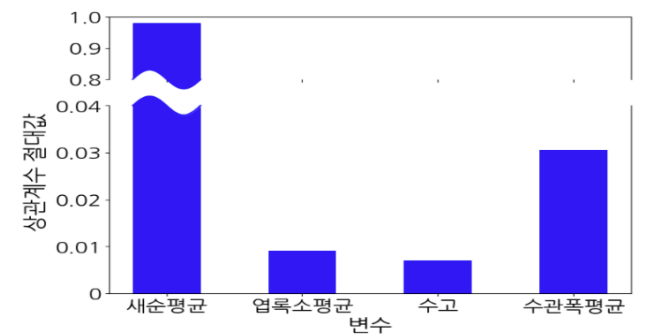
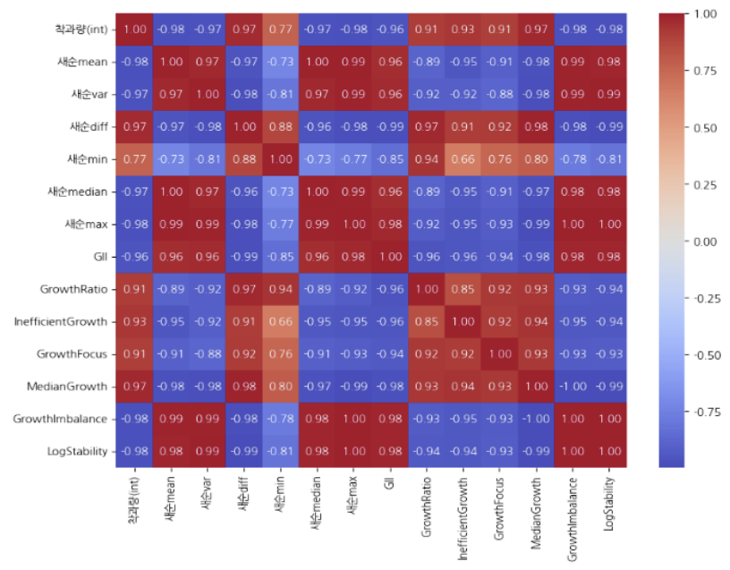

# 감귤 착과량 예측 모델 (KCSE 2025)

> **상관관계 기반 파생변수 생성과 AutoML을 활용한 감귤 착과량 예측**  
> *KCSE 2025 제27권 제1호 게재 논문*

---

## 논문 정보

- **제목**: 상관관계 기반 파생변수 생성과 AutoML을 활용한 감귤 착과량 예측
- **저자**: 서재석, 강준혁, 장근혁, 정아영, 김준화
- **소속**: 건양대학교 의료인공지능학과, 인공지능학과
- **대회**: [DACON 감귤 착과량 예측 AI 경진대회](https://dacon.io/competitions/official/236038/overview/description)
- **문의**: jh55603364@gmail.com

---

## 연구 개요

감귤 착과량 예측은 수확 전략과 농가 생산성 향상에 매우 중요합니다.  
본 연구에서는 새순 데이터를 기반으로 **상관관계 높은 파생변수**를 설계하고,  
AutoML(Mljar-Supervised)을 적용하여 예측 모델의 성능을 크게 향상시켰습니다.

---

## 주요 파생변수 설계

### 기본 파생변수

| 변수 | 의미 |
|------|------|
| mean | 새순 평균 |
| var | 분산 |
| diff | 차분 |
| max | 최댓값 |
| min | 최솟값 |
| median | 중앙값 |

### 추가 파생변수

| 변수 | 의미 |
|------|------|
| GII | 성장 불안정성 |
| Growth Ratio | 성장 비율 |
| Growth Focus | 성장 집중도 |
| Inefficient Growth | 성장 비효율성 |
| Median Growth | 성장 중앙값 |
| Growth Imbalance | 성장 불균형성 |
| Log Stability | 로그 기반 안정성 |

---

## 시각화 예시

### 상관계수 절댓값 비교

### 파생변수 간 상관 히트맵

---

## 사용 모델 및 실험

- **모델**: Random Forest, Extra Trees, CatBoost
- **AutoML**: MLJAR-Supervised
- **지표**: NMAE (Normalized Mean Absolute Error)

### NMAE 성능 비교 (일부 결과)

| 파생변수 조합 | NMAE |
|---------------|------|
| Baseline | 0.1016 |
| 기본 변수 포함 | 0.0723 |
| GII + Growth Ratio + Log Stability 포함 | **0.0714** ⭐️ |

---

## 결론 및 기여

- 새순 기반 상관 분석으로 유의미한 파생변수 도출
- AutoML 자동 최적화를 통한 예측 성능 향상 (NMAE 29% ↓)
- 스마트 농업 예측 정확도 향상 및 다양한 작물 확장 가능성

---

## 향후 과제

- 기후, 토양 등 환경 변수 추가
- 딥러닝 기반 시계열 모델 도입
- 사과, 포도 등 타 작물 확장 적용

---

## 참고문헌

[1] Jeju 감귤재배 매뉴얼, [2] 이봉규, [3] Chandrashekar, [4] MLJAR-Supervised, ...  
(논문 내 참고문헌 [1]~[10] 참고)

---

## 🏷️ 라이선스

본 연구는 [2021RIS-004] 지역혁신사업 및 [2024-0-00047] SW중심대학 사업의 지원을 받았습니다.

